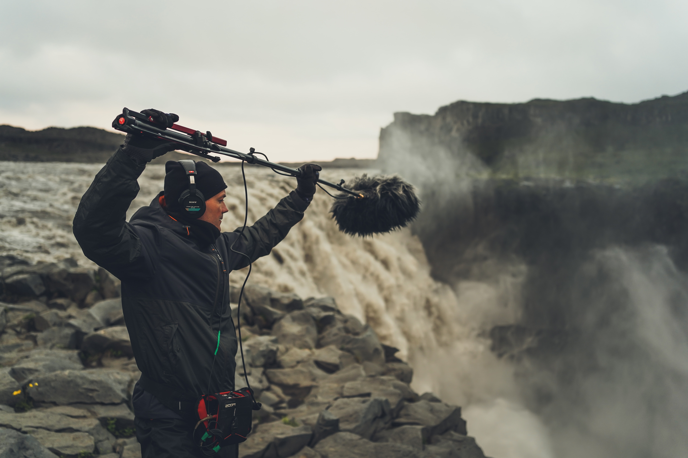

# DAD 310 - Digital Soundtrack Production

This course is designed to explore multiple applications of sound design and their various professional horizons, such as: sound design for manufactured objects, public spaces, web-based applications, games, mobile apps, radio programs. One of the objectives of this course is to introduce students to the concepts of user and experience-centered sound design. A strong emphasis will be put on creativity, reactivity and agility asking the students to rapidly respond with a conceptualized sound design to the various solicitations. At the end of the semester, students will select from all the prototypes produced by the whole class one that they will decide to bring to a more finalized state.

- [syllabus](pages/syllabus)
- [schedule](pages/schedule)
- [projects](pages/projects)
- [resources](pages/resources)